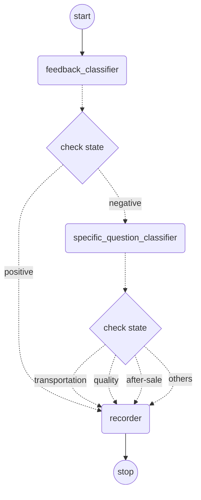

该服务提供了一个客户评价分类处理的接口，根据对话信息，返回归类结果。

http://localhost:18080/customer/chat?query=我收到的产品有快递破损，需要退换货？
```json {"keywords": ["产品", "快递", "破损", "退换货"], "category_name": "after-sale service"} ```

http://localhost:18080/customer/chat?query=我的产品不能正常工作了，要怎么去做维修？
```json [ {"keywords": ["产品", "正常工作", "维修"], "category_name": "after-sale service"} ] ```

http://localhost:18080/customer/chat?query=商品收到了，非常好，下次还会买。
Praise, no action taken.

The workflow chat shows below.
- We first use a feedback_classifier to determine the is positive or negative;
- If it is positive, we just use recorder to write a log;
- If it is negative, we should provide the customer a solution to the specific problem;
- Before providing a solution, we use specific_question_classifier to determine what kind of the problem the negative feedback is;
- The specific_question_classifier classify the problem by 4 types: "after-sale service", "transportation", "product quality", "others"
- We provide the specific solution for the specific feedback(to be implemented, record a log for now)

