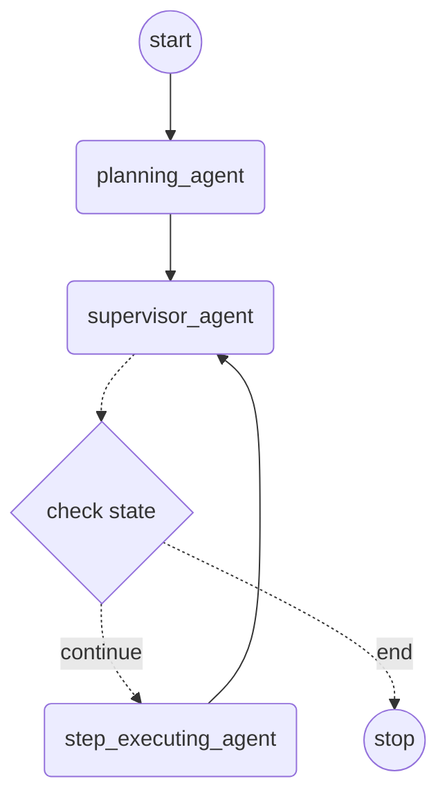

Manus is a general AI agent that can think and plan, then take actions to finish the planned tasks.
- manus is a general ai agent which provide lots of available tools
  - bash execution
  - file saver
  - google search
  - browser using

test manus request:
http://localhost:18081/manus/chat?query=帮我查询阿里巴巴近一周的股票信息

this is not going to work if the llm not using a tool calling, we need to fix the problem with structure the result with a planning object, no matter it use tool or not

As a use for reference to manus, the stock analysis service can give advice to the user's stock require request.
Before the implementation, we should provide:
- The Data: we use AKShare to grab the stock market dataset.
- The Tools:
  - read a local stock financial report which is provided by AKShare
  - analysis local stock price data by code list, all stock price data is provided by AKShare

AKShare:
https://akshare.akfamily.xyz/data/stock/stock.html#id135

