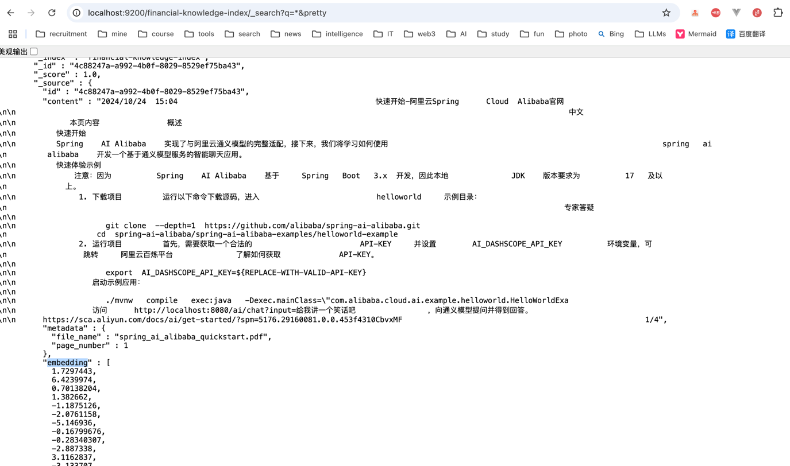
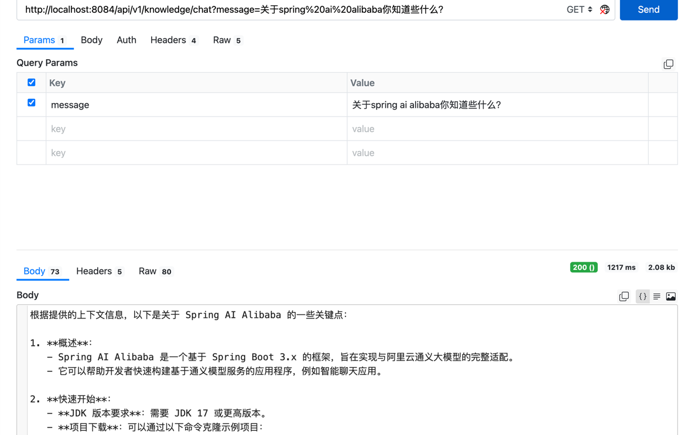

使用RAG实现的金融知识库服务
1、加载pdf文档内容至向量数据库elasticsearch
- 使用合适的DocumentReader读取文件，解析文件内容
- PDF的种类不同，需要使用不同的Reader，比如图片扫描的pdf需要使用OCR技术读取
- OcrPdfReader实现OCR解析PDF依赖Tesseract包（Mac上缺少包解析报错不通过，问题待解决）
- 文档太大时，接口调用可能出现超时问题，生产环境需要异步操作
- 向量数据选型，elasticsearch的优势，近实时检索

调用以下加载并向量化本地classpath下的一个预先存放好的pdf文件：
GET http://localhost:8084/api/v1/knowledge/init

上传一个文件，并读取文件内容加载至向量数据库
POST http://localhost:8084/api/v1/knowledge/import

查看elasticsearch中的数据
http://localhost:9200/_cat/indices?v&pretty
http://localhost:9200/financial-knowledge-index?&pretty
http://localhost:9200/financial-knowledge-index/_search?q=*&pretty

2、调用接口发送聊天请求
- ChatClient配置向量数据库，对话请求先根据message从elasticsearch中查询相似读topK的数据
- topK数据与message整合成新的message交个LLM
- 系统提示词中配置，要求只回答和向量数据库中数据相关的问题，该配置整合成新的message交个LLM
- LLM返回数据，结果符合系统提示词要求
http://localhost:8084/api/v1/knowledge/chat?message=关于spring%20ai%20alibaba你知道些什么？
