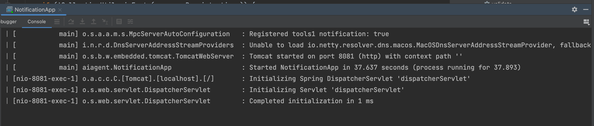
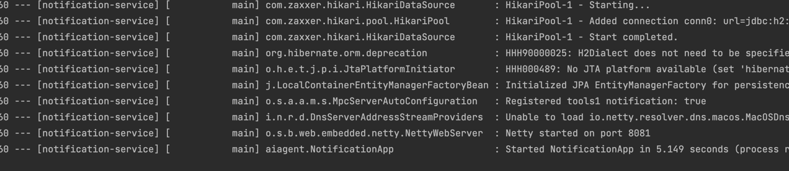

this is the notification readme file
this microservice is responsible for sending notifications to users

this project also acts as a mcp server

- we added maven dependencies
  - spring-ai-mcp-server-webflux-spring-boot-starter
  - spring-web
- the spring-boot-starter-web dependency should be removed as it conflicts with the webflux dependency
- we can see the mcp server use NettyWebServer, while the spring boot uses TomcatWebServer.
- if the dependency is configured right, the mcp server should not handle the sse requests.
- curl -v http://localhost:8081/sse will return a 404 error.

