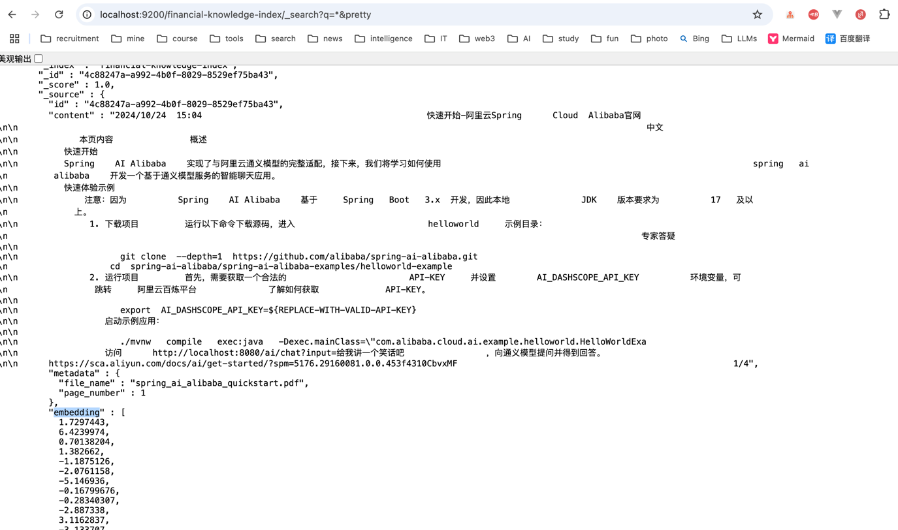
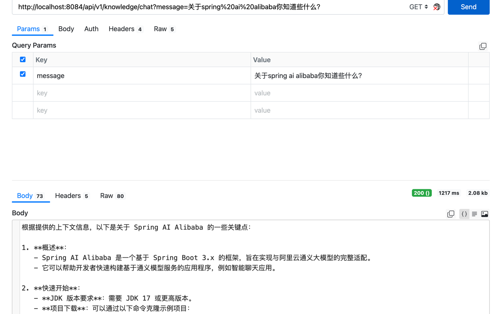

使用RAG实现的金融知识库服务
1、加载pdf文档内容至向量数据库elasticsearch
- 使用合适的DocumentReader读取文件，解析文件内容
- PDF的种类不同，需要使用不同的Reader，比如图片扫描的pdf需要使用OCR技术读取
- OcrPdfReader实现OCR解析PDF依赖Tesseract包（Mac上缺少包解析报错不通过，问题待解决）
- 文档太大时，接口调用可能出现超时问题，生产环境需要异步操作
- 向量数据选型，elasticsearch的优势，近实时检索

调用以下加载并向量化本地classpath下的一个预先存放好的pdf文件：
GET http://localhost:8084/api/v1/knowledge/init

上传一个文件，并读取文件内容加载至向量数据库
POST http://localhost:8084/api/v1/knowledge/import

查看elasticsearch中的数据
http://localhost:9200/_cat/indices?v&pretty
http://localhost:9200/financial-knowledge-index?&pretty
http://localhost:9200/financial-knowledge-index/_search?q=*&pretty



2、调用接口发送聊天请求
- ChatClient配置向量数据库，对话请求先根据message从elasticsearch中查询相似读topK的数据
- topK数据与message整合成新的message交个LLM
- 系统提示词中配置，要求只回答和向量数据库中数据相关的问题，该配置整合成新的message交个LLM
- LLM返回数据，结果符合系统提示词要求

询问不想干的知识：
http://localhost:8084/api/v1/knowledge/chat?message=%E5%85%B3%E4%BA%8E%E7%9F%A5%E8%AF%86%E5%BA%93%E4%BD%A0%E7%9F%A5%E9%81%93%E4%BA%9B%E4%BB%80%E4%B9%88%EF%BC%9F
询问Spring AI alibaba:
http://localhost:8084/api/v1/knowledge/chat?message=%E5%85%B3%E4%BA%8Espring%20ai%20alibaba%E4%BD%A0%E7%9F%A5%E9%81%93%E4%BA%9B%E4%BB%80%E4%B9%88%EF%BC%9F


PagePdfDocumentReader read a pdf file return empty

If `PagePdfDocumentReader` is returning empty content when reading a PDF file, here are the potential causes and solutions:

### Common Causes
1. **Encrypted/Password-Protected PDF**
2. **Scanned PDF (Image-based)**
3. **Corrupted PDF File**
4. **Text Extraction Configuration Issues**
5. **PDF Contains No Extractable Text**

### Debugging Steps

#### 1. Verify PDF File Quality
```java
File pdfFile = new File("your.pdf");
System.out.println("File exists: " + pdfFile.exists());
System.out.println("File size: " + pdfFile.length() + " bytes");
```

#### 2. Try Alternative PDF Libraries
First add Apache PDFBox to your dependencies:
```xml
<dependency>
    <groupId>org.apache.pdfbox</groupId>
    <artifactId>pdfbox</artifactId>
    <version>3.0.1</version>
</dependency>
```

Test with PDFBox directly:
```java
try (PDDocument document = PDDocument.load(new File("your.pdf"))) {
    PDFTextStripper stripper = new PDFTextStripper();
    String text = stripper.getText(document);
    System.out.println("Extracted text length: " + text.length());
    System.out.println("First 500 chars: " + text.substring(0, Math.min(500, text.length())));
}
```

#### 3. Check for Scanned PDFs
```java
// In PDFBox approach
if (document.getPages().stream().allMatch(page -> 
    page.getResources().getXObjects().isEmpty())) {
    System.out.println("This appears to be a scanned image PDF");
}
```

### Solutions

#### For Regular PDFs (Spring AI Approach)
```java
@Bean
public DocumentReader pdfDocumentReader() {
    // Explicitly set PDF parser options
    return new PagePdfDocumentReader(
        new ClassPathResource("your.pdf"),
        new PdfDocumentReaderConfig(
            true,  // extractAcroFormContent
            true   // extractEmbedded
        )
    );
}

// Then test reading
List<Document> documents = pdfDocumentReader().get();
documents.forEach(doc -> {
    System.out.println("Content length: " + doc.getContent().length());
    System.out.println("Metadata: " + doc.getMetadata());
});
```

#### For Scanned PDFs (OCR Required)
Add Tesseract OCR:
```java
@Bean
public DocumentReader ocrPdfReader() {
    // Requires Tesseract installed locally
    return new TesseractPdfDocumentReader(
        new ClassPathResource("scanned.pdf"),
        new TesseractPdfDocumentReaderConfig(
            "eng",  // language
            300     // DPI for image conversion
        )
    );
}
```

#### For Password-Protected PDFs
```java
@Bean
public DocumentReader securedPdfReader() {
    return new PagePdfDocumentReader(
        new ClassPathResource("secured.pdf"),
        "password123",  // owner password
        new PdfDocumentReaderConfig()
    );
}
```

### Complete Working Example
```java
@Service
public class PdfService {

    public List<Document> readPdf(String filePath) {
        try {
            Resource resource = new FileSystemResource(filePath);
            DocumentReader reader = new PagePdfDocumentReader(
                resource,
                new PdfDocumentReaderConfig(
                    true,   // extractAcroForm
                    true,   // extractEmbedded
                    true    // extractBookmarks
                )
            );
            
            List<Document> docs = reader.get();
            if (docs.isEmpty()) {
                throw new RuntimeException("No content extracted - possibly scanned PDF");
            }
            return docs;
        } catch (Exception e) {
            throw new RuntimeException("Failed to read PDF: " + filePath, e);
        }
    }
}
```

### Additional Checks
1. **File Permissions**: Ensure the application has read access to the PDF file
2. **PDF Version**: Some very old or very new PDF versions may cause issues
3. **Font Issues**: PDFs with custom/unembedded fonts may extract poorly
4. **Complex Layouts**: Tables, columns, and forms may require special handling

If you still get empty results:
1. Try opening the PDF in a text editor - if you see mostly binary data, it's likely scanned
2. Test with multiple PDF files to isolate the issue
3. Verify no exceptions are being silently caught

For production use, consider implementing a fallback strategy:
```java
public List<Document> readPdfWithFallback(String filePath) {
    try {
        // First try regular extraction
        List<Document> docs = regularPdfReader.read(filePath);
        
        // If empty, try OCR fallback
        if (docs.isEmpty() || docs.stream().allMatch(d -> d.getContent().isBlank())) {
            docs = ocrPdfReader.read(filePath);
        }
        
        return docs;
    } catch (Exception e) {
        // Log and return empty rather than fail
        logger.error("PDF read failed", e);
        return Collections.emptyList(); 
    }
}
```